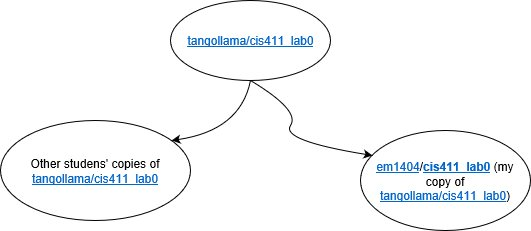
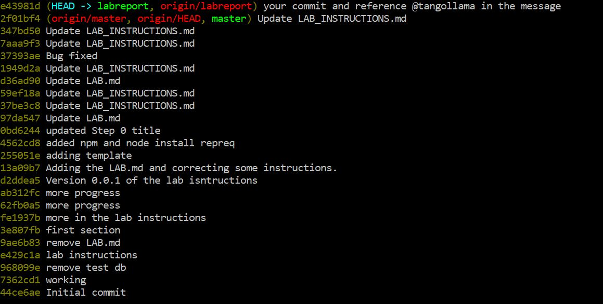
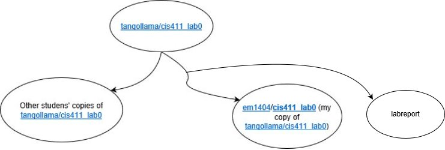
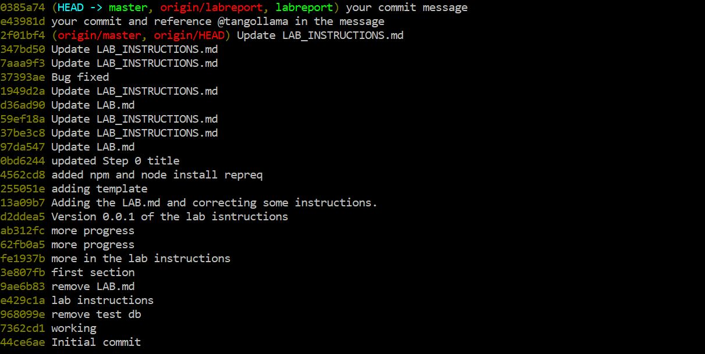
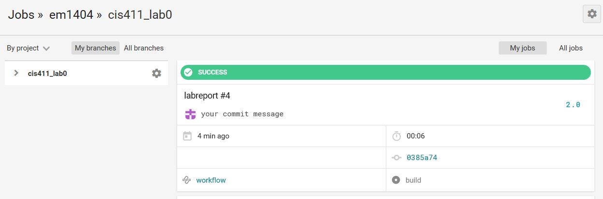

# Lab Report Template for CIS411_Lab0

Course: Messiah College CIS 411, Fall 2018  
Instructors: [Joel Worrall](https://github.com/tangollama) & [Trevor Bunch](https://github.com/trevordbunch)  
Name: Eliezer Mwankenja  
GitHub: [em1404](https://github.com/em1404/cis411_lab0)  

# [](https://github.com/tangollama/cis411_lab0/blob/master/labreports/LAB.md#step-1-fork-this-repository)Step 1: Fork this repository

-   https://github.com/em1404/cis411_lab0
-   

# [](https://github.com/tangollama/cis411_lab0/blob/master/labreports/LAB.md#step-2-clone-your-forked-repository-from-the-command-line)Step 2: Clone your forked repository from the command line

-   My GraphQL response from adding myself as an account on the test project

```
{
  "data": {
    "mutateAccount": {
      "id": "fb427c7f-fb39-4636-853e-32f877ebe887",
      "name": "Eliezer Mwankenja",
      "email": "em1404@messiah.edu"
    }
  }
}
```

# [](https://github.com/tangollama/cis411_lab0/blob/master/labreports/LAB.md#step-3-creating-a-feature-branch)Step 3: Creating a feature branch

-   The output of my git commit log





-   The accompanying diagram of what my feature branch precisely and conceptually represents


# [](https://github.com/tangollama/cis411_lab0/blob/master/labreports/LAB.md#step-4-setup-a-continuous-integration-configuration)Step 4: Setup a Continuous Integration configuration
--
sets up your repository so that circleci can be used during builds and test. 
--
-   What is the .circleci/config.yml doing?  
      it configures your repository for the circleci infrastracture and it allows for testing builds on a separate branch.

-   What do the various sections on the config file do?
  1. version
    * version of the CircleCI platform you are using and used to detect deprecation or breaking changes.
  2. jobs
    *  Specifies the jobs to be run when code is pushed e.g **builds** as required by circleci since its the only job used.
  3. docker
    * An ordered list of run directives executed in the order declared. 
  4. working_directory
    * The location within the container that the build commands will be run
  5. steps
    * A list of commands needed to build, test, and deploy the project.

-   When a CI build is successful, what does that philosophically and practically/precisely indicate about the build?
* It indicates that the build was successfully merged into the base repository and that the new feature was succesfully integrated without causing issues with the base repository. 

-   If you were to take the next step and ready this project for Continuous Delivery, what additional changes might you make in this configuration (conceptual, not code)?
* Provide environment and set the configuration for deployment

# [](https://github.com/tangollama/cis411_lab0/blob/master/labreports/LAB.md#step-5-merging-the-feature-branch)Step 5: Merging the feature branch

-   The output of my git commit log
   
-   A screenshot of the _Jobs_ list in CircleCI
    

# [](https://github.com/tangollama/cis411_lab0/blob/master/labreports/LAB.md#step-6-submitting-a-pull-request)Step 6: Submitting a Pull Request

_Remember to reference at least one other student in the PR content via their GitHub handle._


