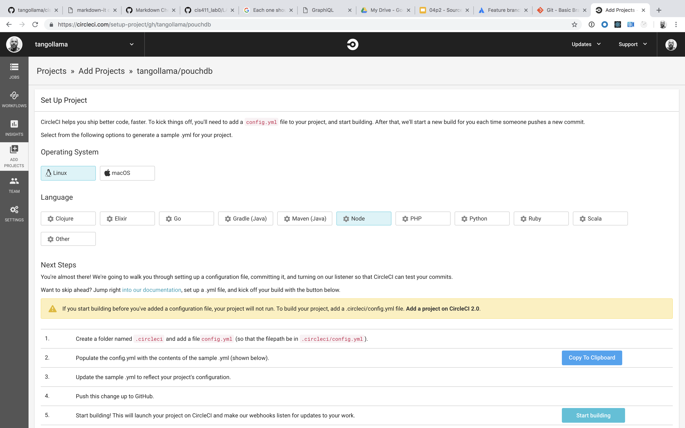

# CIS 411 Lab 0: GitHub + CircleCI
The purpose of this lab is to both impart/confirm a level of professional comfort working with tools like GitHub and CircleCI as well as to invite a student to consider what precisely is happening conceptually and actually (behind the scenes) in the execution of the lab. 

## Submitting work
Lab reports will be submitted by generating a markdown file in the labreports directory under the naming convention: **LAB_[GITHUB HANDLE].md**, and submitting a Pull Request to this repository that include your lab report as well as any accompanying images/files (there are diagrams required in the lab content). 

* Throughout these instructions, you'll find that **items marked in bold text** reference content you are to submit in your lab report.
* For the purposes of clear communication, you may base your lab report off of the template found in [LAB.md](LAB.md), but you're also free, welcome, and encouraged to get more creative.
* If you are unfamiliar with markdown, I recommend checking [1000 places on the Interwebs](http://lmgtfy.com/?q=learn+markdown) that will help you close that gap.

# Step 0: Create a GitHub account++
1. If you don't have a GitHub account already, [create one](https://github.com/join). If you do, **record the name of your handle in your lab report** and **record a link to one repository you either follow or star**.
2. If you don't already have _git_ installed on your development machine, [do so](https://git-scm.com/downloads).
3. Install a text editor or some sort of application for local development. Lately, I'm partial to [Visual Studio Code](https://code.visualstudio.com/) and my instructions assume it's use, but you're welcome to diviate. _Each one should choose their own sword, etc. etc._
4. To run the project in Step 2, you'll need to have [node.js](https://nodejs.org/en/download/) and [npm](https://docs.npmjs.com/cli/install) installed.

# Step 1: Fork this repository
1. After logging in, navigate to the [root](https://github.com/tangollama/cis411_lab0) of this repository.
2. Fork this repository to your personal GitHub account (hint: read the page).
3. **Record the URL to your forked repo in your lab report.**
4. **Generate a simple diagram** (in Google Draw or your favorite diagramming tool) that demonstrates the relationship between _this_ repository and my account (tangollama) with your account and your newly forked repository. (i.e. Is this the same thing as a source control branch or is there something unique about a fork in a distributed version control system? _Hint... I'm asking for a reason._ If it's helpful, think about the relationship you and another student who is conducting the fork command each has to this respository.)

# Step 2: Clone your forked repository from the command line
1. Navigate to your forked repository in your GitHub account and copy the reference to your repository in from the <button class="btn btn-sm btn-primary">Clone or Download</button> button.
2. Open the terminal or command line interface on your development machine, navigate to your chosen working directory, and execute the following command: ```git clone [YOUR COPIED GITHUB CLONE REFERENCE]```.
3. Navigate to that directory ```cd cis411_lab0```.
4. Run ```npm install``` and watch the magic happen.
5. Run ```npm start``` and navigate to http://localhost:4000/graphql.
6. Run the following GraphQL mutation in GraphiQL and **record the response**.
```
mutation {
  mutateAccount(input: {
    email: "YOUR EMAIL"
    name: "YOUR FULL NAME"
    mutation: "add"
  }) {
    id
    name
    email
  }
}
```

# Step 3: Creating a feature branch
[Branching and merging](https://www.atlassian.com/agile/software-development/branching) is a common tactic used in change management and feature development. We're going to use a branch (and eventually a merge) to build our lab report.
1. Create the branch ```git  checkout -b labreport```.
2. Create a lab report mardown file (ex. ```cp labreports/LAB.md labreports/LAB_[GITHUB USERNAME].md``` ).
3. Add your lab report ```git add *```
4. Add the file to your branch ```git commit -a -m "your commit and reference @tangollama in the message"```.
5. Push the change to GitHub ```git push -u origin labreport```.
6. As you make additional changes to the lab report, commit and push at least one more change to the branch.
7. **Add the output of your git commit log** for your feature branch to your lab report ```git log  --oneline```.
8. **Generate a simple diagram** that demonstrates the relationship between your master and feature branch in your forked repository.

# Step 4: Setup a Continuous Integration configuration
1. [Signup for CircleCI](https://circleci.com/signup/) with your GitHub account.
2. Login to CircleCI and add your project to your account (ex. https://circleci.com/add-projects/gh/[YOUR_GITHUB_HANDLE]) by clicking _Add Project_.
3. Follow the setup instructions, including creating the .circleci directory and adding the default config.yml file.

- Create a directory name .circleci in your project ```mkdir .circleci```.
- Add a file to that directory named config.yml ```code .circleci/config.yml```.
- Copy the content for the setup instructions into config.yml.
4. **Document in your lab report** what your .circleci/config.yml is doing in as much detail as you can determine. A diagram is not required but is highlt encouraged. **Additionally, answer the following questions.**
- What do the various sections on the config file do?
- When a CI build is successful, what does that philosophically and practically/precisely indicate about the build?
- If you were to take the next step and ready this project for Continuous Delivery, what additional changes might you make in this configuration (conceptual, not code)?

# Step 5: Merging the feature branch
1. Commit your changes to your feature branch ```git commit -a -m "your commit message```.
2. Switch to the master branch ```git checkout master```.
3. Merge the changes from your feature branch ```git merge labreport```.
4. **Add the output of your git commit log** from master to your lab report ```git log  --oneline```.
5. Validate that your CircleCI build is running doing so successfully, **by grabbing a screenshot of the _Jobs_ list in CircleCI and including it in your report**.

# Step 6: Submitting a Pull Request
Once you've completed your report markdown, have ensured that your forked repository is successfully running in CircleCI, and have committed all your changes to your (primary) master branch, initiate a Pull Request in GitHub to submit your Lab Report.
1. Navigate to the root of your forked repository (ex. https://github.com/YOURHANDLE/cis411_lab0).
2. Click the _New pull request_ button.
3. Choose the base fork _tangollama/cis411_lab0_ is the target and that your fully updated _master_ branch is the source.
4. Enter a title and description for the Pull Request (PR), **referencing at least one other student in the content via their GitHub handle**, and submit the PR.

# Step 7: [EXTRA CREDIT] Augment the core project
For the purposes of gaining 10%, 20% _or even more extra credit_ on the assignment, perform any of the following:
1. Add one or more unit tests to the core assignment project. 
2. Configure the CircleCI config.yml to automatically build a Docker image of the project.
3. Configure an automatic deployment of the successful CircleCI build to an Amazon EC2 instance.

**Note this work in your lab report** by submitting it in your PR and linking to either the PR or the specific commit as recorded in GitHub in your lab report.
