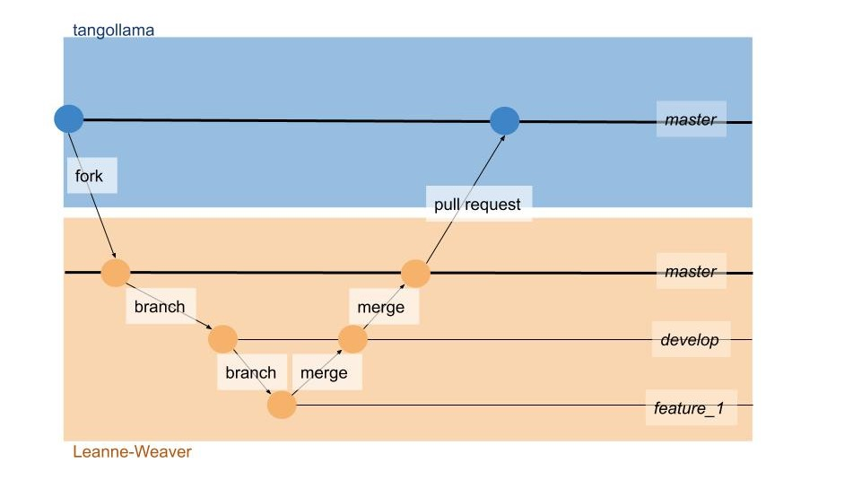
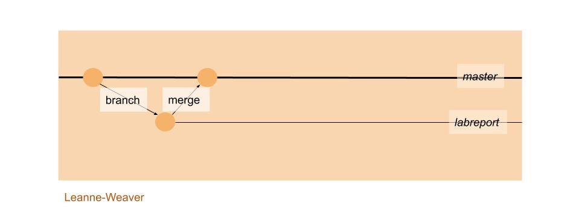
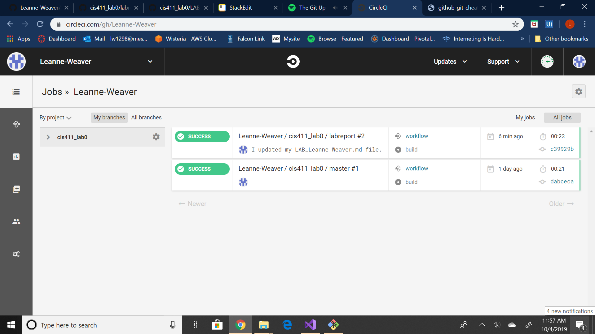

# Lab Report Template for CIS411_Lab0
Course: Messiah College CIS 411, Fall 2018<br/>
Instructors: [Joel Worrall](https://github.com/tangollama) & [Trevor Bunch](https://github.com/trevordbunch)<br/>
Name: Leanne Weaver<br/>
GitHub: Leanne-Weaver (https://github.com/Leanne-Weaver)<br/>

# Step 1: Fork this repository
- The URL of my forked repository
	https://github.com/Leanne-Weaver/cis411_lab0
- The accompanying diagram of what my fork precisely and conceptually represents
(Additional branches, develop and feature_1, were used to demonstrate the difference between a fork and a merge, 
as well as the difference between a merge and a pull request.)

# Step 2: Clone your forked repository from the command line
- My GraphQL response from adding myself as an account on the test project
```
{
  "data": {
    "mutateAccount": {
      "id": "1d24d39d-b931-469c-a9ec-458c459ed609",
      "name": "Leanne Weaver",
      "email": "lw1298@messiah.edu"
    }
  }
}
```

# Step 3: Creating a feature branch
- The output of my git commit log
```
dac0301 (HEAD -> labreport, origin/labreport) Hey @tangollama, I have committed 
my mardown files.                                                               
dabceca (origin/master, origin/HEAD, master) Merge pull request #24 from tangoll
ama/circleci                                                                    
a4096db Create README.md                                                        
2f01bf4 Update LAB_INSTRUCTIONS.md                                              
347bd50 Update LAB_INSTRUCTIONS.md                                              
7aaa9f3 Update LAB_INSTRUCTIONS.md                                              
37393ae Bug fixed                                                               
1949d2a Update LAB_INSTRUCTIONS.md                                              
d36ad90 Update LAB.md                                                           
59ef18a Update LAB_INSTRUCTIONS.md                                              
37be3c8 Update LAB_INSTRUCTIONS.md                                              
97da547 Update LAB.md                                                           
0bd6244 (origin/purelab) updated Step 0 title                                   
4562cd8 added npm and node install repreq                                       
255051e adding template                                                         
13a09b7 Adding the LAB.md and correcting some instructions.                     
d2ddea5 Version 0.0.1 of the lab isntructions                                   
ab312fc more progress                                                           
62fb0a5 more progress                                                           
fe1937b more in the lab instructions                                            
3e807fb first section                                                       
```
- The accompanying diagram of what my feature branch precisely and conceptually represents


# Step 4: Setup a Continuous Integration configuration
- What is the .circleci/config.yml doing?<br/>
This is a YAML (YAML Ain't Markup Language) file that identifies how the testing environment will be set up, along with the kind of tests that will be run.<br/>
- What do the various sections on the config file do?<br/>
The ```version``` portion specifies which version of CircleCI will be used.
The ```jobs``` portion contains instructions for jobs that CircleCI might execute.
The ```build``` is one of the jobs. In ```docker```, a Docker image is specified, which will be the job's primary container for when CircleCI launches a virtual environment.
The portion ```steps``` specifies the actions to be taken within the job ```build```.
The first of the ```steps``` to be taken is that CircleCI will ```checkout``` of the GitHub repository and clone it into the virtual environment it launched.
Next, with ```restore_cache``` with the given ```keys```, CircleCI restores dependencies. (This will help when we run yarn install, where only new dependencies will need to be downloaded.)
Then CircleCI runs the command ```yarn install```, which installs Yarn, a packaged dependency manager.
Afterwards, CircleCI will save the data in the cache to update it.
Finally, ```yarn test``` is ran by CircleCI to ensure that it was installed successfully.
The ```workflows``` is a set of rules for defining a collection of jobs and their execution order.

I used CircleCI documentation, [Adding a YML File](https://circleci.com/docs/2.0/getting-started/#adding-a-yml-file), [Workflows Overview](https://circleci.com/docs/2.0/workflows/#overview), and [Caching](https://circleci.com/docs/2.0/caching/), to inform me about the portions of the code used.<br/>
- When a CI build is successful, what does that philosophically and practically/precisely indicate about the build?<br/>
When a build is successful, that means that there were no errors when CircleCI was following the instructions specified in the .yaml file; the environment was spun, the workflows executed, and the jobs completed.
- If you were to take the next step and ready this project for Continuous Delivery, what additional changes might you make in this configuration (conceptual, not code)?<br/>

# Step 5: Merging the feature branch
* The output of my git commit log
```
dac0301 (HEAD -> master, origin/labreport, labreport) Hey @tangollama, I have co
mmitted my mardown files.                                                       
dabceca (origin/master, origin/HEAD) Merge pull request #24 from tangollama/circ
leci                                                                            
a4096db Create README.md                                                        
2f01bf4 Update LAB_INSTRUCTIONS.md                                              
347bd50 Update LAB_INSTRUCTIONS.md                                              
7aaa9f3 Update LAB_INSTRUCTIONS.md                                              
37393ae Bug fixed                                                               
1949d2a Update LAB_INSTRUCTIONS.md                                              
d36ad90 Update LAB.md                                                           
59ef18a Update LAB_INSTRUCTIONS.md                                              
37be3c8 Update LAB_INSTRUCTIONS.md                                              
97da547 Update LAB.md                                                           
0bd6244 (origin/purelab) updated Step 0 title                                   
4562cd8 added npm and node install repreq                                       
255051e adding template                                                         
13a09b7 Adding the LAB.md and correcting some instructions.                     
d2ddea5 Version 0.0.1 of the lab isntructions                                   
ab312fc more progress                                                           
62fb0a5 more progress                                                           
fe1937b more in the lab instructions                                            
3e807fb first section                                                           
 ESCOD                                                                          
dac0301 (HEAD -> master, origin/labreport, labreport) Hey @tangollama, I have co
mmitted my mardown files.                                                       
dabceca (origin/master, origin/HEAD) Merge pull request #24 from tangollama/circ
leci                                                                            
a4096db Create README.md                                                        
2f01bf4 Update LAB_INSTRUCTIONS.md                                              
347bd50 Update LAB_INSTRUCTIONS.md                                              
7aaa9f3 Update LAB_INSTRUCTIONS.md                                              
37393ae Bug fixed                                                               
1949d2a Update LAB_INSTRUCTIONS.md                                              
d36ad90 Update LAB.md                                                           
59ef18a Update LAB_INSTRUCTIONS.md                                              
37be3c8 Update LAB_INSTRUCTIONS.md                                              
97da547 Update LAB.md                                                           
0bd6244 (origin/purelab) updated Step 0 title                                   
4562cd8 added npm and node install repreq                                       
255051e adding template                                                         
13a09b7 Adding the LAB.md and correcting some instructions.                     
d2ddea5 Version 0.0.1 of the lab isntructions                                   
ab312fc more progress                                                           
62fb0a5 more progress                                                           
fe1937b more in the lab instructions                                            
3e807fb first section                                                     
```
* A screenshot of the _Jobs_ list in 


# Step 6: Submitting a Pull Request
_Remember to reference at least one other student in the PR content via their GitHub handle._

# Step 7: [EXTRA CREDIT] Augment the core project
PR reference in the report to one of the following:
1. Add one or more unit tests to the core assignment project. 
2. Configure the CircleCI config.yml to automatically build a Docker image of the project.
3. Configure an automatic deployment of the successful CircleCI build to an Amazon EC2 instance.
