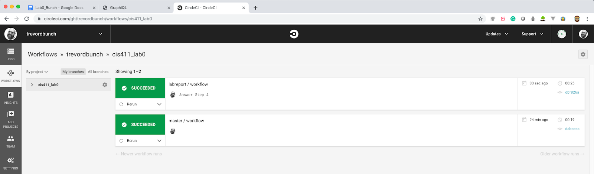

# Lab Report: Continuous Integration
___
**Course:** CIS 411, Spring 2021  
**Instructor(s):** [Trevor Bunch](https://github.com/trevordbunch)  
**Name:** Reid Burger 
**GitHub Handle:** @ReidBurger  
**Repository:** Your Forked Repository  
___

# Step 1: Fork this repository
- The URL of my forked repository: https://github.com/ReidBurger/cis411_lab1_CI
- The accompanying diagram of what my fork precisely and conceptually represents: 

 

# Step 2: Clone your forked repository from the command line  
- My local file directory is Desktop/cis411_lab1_CI
- The command to navigate to the directory when I open up the command line is cd cis411_lab1_CI

# Step 3: Run the application locally
- My GraphQL response from adding myself as an account on the test project
``` json
{
  "data": {
    "mutateAccount": {
      "id": "c99ab5d1-95f1-4fac-8e29-11767a26c8de",
      "name": "Reid Burger",
      "email": "rb1504@messiah.edu"
    }
  }
}
```

# Step 4: Creating a feature branch
- The output of my git commit log
```
0d5b1d9 (HEAD -> labreport, origin/labreport) First Try @trevordbunch
7490dcb (origin/main, origin/HEAD, main) Add Links to Node in Instructions
ecaaa53 Update branch terminology
c552213 Merge pull request #3 from hallienicholas/main
78ede9f Corrected error
1fe415c Merge pull request #1 from trevordbunch/labreport
13e571f Update Lab readme, instructions and templates
eafe253 Adjust submitting instructions
47e83cd Add images to LabReport
ec18770 Add Images
dbf826a Answer Step 4
a9c1de6 Complete Step 1, 2 and 3 of LAB_TREVORDBUNCH
1ead543 remove LAB.md
8c38613 Initial commit of labreport with @tangollama
dabceca Merge pull request #24 from tangollama/circleci
a4096db Create README.md
2f01bf4 Update LAB_INSTRUCTIONS.md
347bd50 Update LAB_INSTRUCTIONS.md
7aaa9f3 Update LAB_INSTRUCTIONS.md
37393ae Bug fixed
1949d2a Update LAB_INSTRUCTIONS.md
d36ad90 Update LAB.md
59ef18a Update LAB_INSTRUCTIONS.md
```
- The accompanying diagram of what my feature branch precisely and conceptually represents...

# Step 5: Setup a Continuous Integration configuration
```
# Javascript Node CircleCI 2.0 configuration file
#
# Check https://circleci.com/docs/2.0/language-javascript/ for more details
#
version: 2
jobs:
  build:
    docker:
      # specify the version you desire here
      - image: circleci/node:10.3
      
      # Specify service dependencies here if necessary
      # CircleCI maintains a library of pre-built images
      # documented at https://circleci.com/docs/2.0/circleci-images/
      # - image: circleci/mongo:3.4.4

    working_directory: ~/repo

    steps:
      - checkout

      # Download and cache dependencies
      - restore_cache:
          keys:
          - v1-dependencies-{{ checksum "package.json" }}
          # fallback to using the latest cache if no exact match is found
          - v1-dependencies-

      - run: yarn install

      - save_cache:
          paths:
            - node_modules
          key: v1-dependencies-{{ checksum "package.json" }}
        
      # run tests!
      - run: yarn test
```

- What is the .circleci/config.yml doing?  
    - config.yml identifies which software it has to install (like yarn) and the type of vitual machine being used. 

- What do the various sections on the config file do?  
    - The "docker" section shows which version of node we are using (node:10.3) 
    - The "working_directory" section shows which repo circleci should work on, in this case, the directory located one step back in the tree.  
    - The "steps" section is broken up into a few small sections. In summary, these sections are used to determine which software to install, in this case, yarn. 

- When a CI build is successful, what does that philosophically and practically/precisely indicate about the build?  
  - When a CI build is successful, that means that the code runs correctly and is compatible with the current build. The code is secure and can be safely deployed without breaking anything. 
   

- If you were to take the next step and ready this project for Continuous Delivery, what additional changes might you make in this configuration (conceptual, not code)?  
  - There would need to be a part in the config file that deploys the updated code to the original repo or branch after it's been successfully built.
   

# Step 6: Merging the feature branch
* The output of my git commit log
```
4418a33 (HEAD -> labreport, origin/labreport) Questions Answered @trevordbunch
ef466dd Figured it out I think @trevordbunch
7959f45 Terminal is gaslighting me @trevordbunch
0ef3276 Added Name @trevordbunch
f49c2ce Trying Again @trevordbunch
0d5b1d9 First Try @trevordbunch
7490dcb (origin/main, origin/HEAD, main) Add Links to Node in Instructions
ecaaa53 Update branch terminology
c552213 Merge pull request #3 from hallienicholas/main
78ede9f Corrected error
1fe415c Merge pull request #1 from trevordbunch/labreport
13e571f Update Lab readme, instructions and templates
eafe253 Adjust submitting instructions
47e83cd Add images to LabReport
ec18770 Add Images
dbf826a Answer Step 4
a9c1de6 Complete Step 1, 2 and 3 of LAB_TREVORDBUNCH
1ead543 remove LAB.md
8c38613 Initial commit of labreport with @tangollama
dabceca Merge pull request #24 from tangollama/circleci
a4096db Create README.md
2f01bf4 Update LAB_INSTRUCTIONS.md
347bd50 Update LAB_INSTRUCTIONS.md
```

* A screenshot of the _Jobs_ list in CircleCI


# Step 7: Submitting a Pull Request
_Remember to reference at least one other student in the PR content via their GitHub handle._


# Step 8: [EXTRA CREDIT] Augment the core project
PR reference in the report to one of the following:
1. Add one or more unit tests to the core assignment project. 
2. Configure the CircleCI config.yml to automatically build a Docker image of the project.
3. Configure an automatic deployment of the successful CircleCI build to an Amazon EC2 instance.
