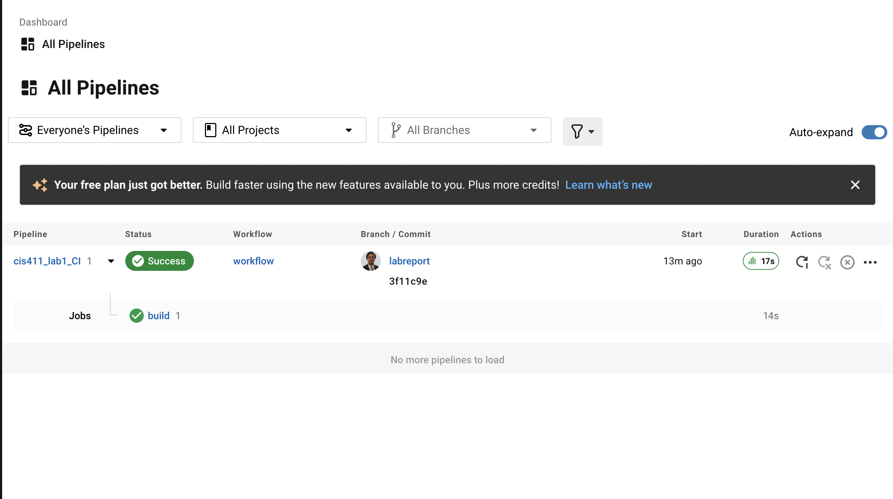

# Lab Report: Continuous Integration

___
**Course:** CIS 411, Spring 2021  
**Instructor(s):** [Trevor Bunch](https://github.com/trevordbunch)  
**Name:** Your Name  
**GitHub Handle:** Your GitHub Handle  
**Repository:** Your Forked Repository  
___

# Step 1: Fork this repository

- The URL of my forked repository: ENTER URL HERE
- The accompanying diagram of what my fork precisely and conceptually represents...

# Step 2: Clone your forked repository from the command line  

- My local file directory is...
- The command to navigate to the directory when I open up the command line is...

# Step 3: Run the application locally

- My GraphQL response from adding myself as an account on the test project

``` json
{
  "data": {
    "mutateAccount": {
      "id": "f9229cbe-a5b2-4736-be93-65e722799b48",
      "name": "Sebastian ALejos Acosta",
      "email": "sa1251@messiah.edu"
    }
  }
}
```

# Step 4: Creating a feature branch

- The output of my git commit log

```
3f11c9e (HEAD -> labreport, origin/labreport) Part 4 of the lab @trevordbunch
7490dcb (upstream/main, origin/main, origin/HEAD, main) Add Links to Node in Instructions
ecaaa53 Update branch terminology
c552213 Merge pull request #3 from hallienicholas/main
78ede9f Corrected error
1fe415c Merge pull request #1 from trevordbunch/labreport
13e571f Update Lab readme, instructions and templates
eafe253 Adjust submitting instructions
47e83cd Add images to LabReport
ec18770 Add Images
dbf826a Answer Step 4
a9c1de6 Complete Step 1, 2 and 3 of LAB_TREVORDBUNCH
1ead543 remove LAB.md
8c38613 Initial commit of labreport with @tangollama
```

- The accompanying diagram of what my feature branch precisely and conceptually represents...
  
Credit: By Vincent Driessen, <https://nvie.com/posts/a-successful-git-branching-model/>


# Step 5: Setup a Continuous Integration configuration

- What is the .circleci/config.yml doing?  

It is setting up the environment in which the project will operate, such as setting the tests, and installing what needs to be installed.

- What do the various sections on the config file do?  

The image section identifies the version of CircleCI that we are going to be using, the working directory sets up where we are going to be running the program. Steps identify a series of commands that are going to be run in the terminal. It also sets up variabble for cache in order for the program to run succesfully.

- When a CI build is successful, what does that philosophically and practically/precisely indicate about the build?

It means that your program passed all the tests and QA that were setup, meaning that the application is ready for deployment.

- If you were to take the next step and ready this project for Continuous Delivery, what additional changes might you make in this configuration (conceptual, not code)?

I would need to merge the code I just wrote to the main branch, and setup the hosting service that I am using in order to deploy the code.

# Step 6: Merging the feature branch

- The output of my git commit log

```
7c7c2e4 (HEAD -> main, labreport) Completed step 5 of the lab
3f11c9e (origin/labreport) Part 4 of the lab @trevordbunch
7490dcb (upstream/main, origin/main, origin/HEAD) Add Links to Node in Instructions
ecaaa53 Update branch terminology
c552213 Merge pull request #3 from hallienicholas/main
78ede9f Corrected error
1fe415c Merge pull request #1 from trevordbunch/labreport
13e571f Update Lab readme, instructions and templates
eafe253 Adjust submitting instructions
47e83cd Add images to LabReport
ec18770 Add Images
dbf826a Answer Step 4
a9c1de6 Complete Step 1, 2 and 3 of LAB_TREVORDBUNCH
1ead543 remove LAB.md
```

- A screenshot of the _Jobs_ list in CircleCIs


# Step 7: Submitting a Pull Request

_Remember to reference at least one other student in the PR content via their GitHub handle._

# Step 8: [EXTRA CREDIT] Augment the core project

PR reference in the report to one of the following:
1. Add one or more unit tests to the core assignment project.
2. Configure the CircleCI config.yml to automatically build a Docker image of the project.
3. Configure an automatic deployment of the successful CircleCI build to an Amazon EC2 instance.
