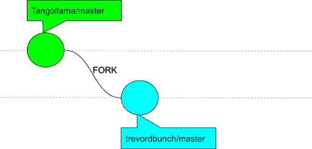
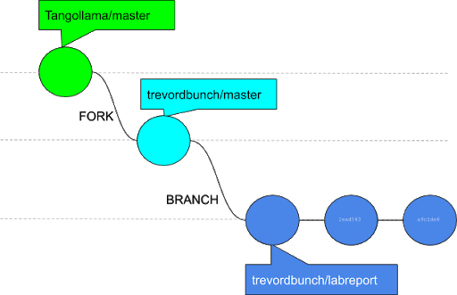

# Lab Report Template for CIS411_Lab0
Course: Messiah College CIS 411, Fall 2018<br/>
Instructors: [Joel Worrall](https://github.com/tangollama) & [Trevor Bunch](https://github.com/trevordbunch)<br/>
Name: Trevor Bunch<br/>
GitHub: [trevordbunch](https://github.com/trevordbunch/)<br/>

# Step 1: Fork this repository
- The URL of my forked repository: https://github.com/trevordbunch/cis411_lab0
- The accompanying diagram of what my fork precisely and conceptually represents
A Fork is simply making a copy for editing 


# Step 2: Clone your forked repository from the command line
- My GraphQL response from adding myself as an account on the test project
```
{
  "data": {
    "mutateAccount": {
      "id": "5c345bb5-0c54-44ae-8e57-f5f00b0eddbb",
      "name": "TREVOR BUNCH",
      "email": "tbunch@messiah.edu"
    }
  }
}
```

# Step 3: Creating a feature branch
- The output of my git commit log
```
Trevors-MBP:cis411_lab0 trevorbunch$ git log --oneline
a9c1de6 (HEAD -> labreport, origin/labreport) Complete Step 1, 2 and 3 of LAB_TREVORDBUNCH
1ead543 remove LAB.md
8c38613 Initial commit of labreport with @tangollama
dabceca (upstream/master, origin/master, origin/HEAD, master) Merge pull request #24 from tangollama/circleci
a4096db Create README.md
...
44ce6ae Initial commit
(END)
```
- The accompanying diagram of what my feature branch precisely and conceptually represents


# Step 4: Setup a Continuous Integration configuration
- What is the .circleci/config.yml doing?
CircleCI is a configuration is code methodology, so this configuration defines jobs that are ran after each commit.

- What do the various sections on the config file do?
`Version` indicates which CircleCI platform you are using.
`Jobs` outlines each workflow, in this case `Build` is the only job, where it outlines the type of docker container to spin up, declares a working direction and the steps are a sequencing of command lines that effectively does 5 steps:
1. Checkouts the current code base
2. Refreshes any supporting library dependencies
3. Installs the application
4. Saves any supporting libraries
5. Runs any defined tests.
   
- When a CI build is successful, what does that philosophically and practically/precisely indicate about the build?
The build should be relatively error free or Approved to start running (dependencies are updated and any outlined tests are passed)

- If you were to take the next step and ready this project for Continuous Delivery, what additional changes might you make in this configuration (conceptual, not code)?
I would do three things: 1) breakout the jobs into a workflow (requiring job sequence/dependencies), 2) further define tests, and 3) create different workflows per environment (dev, staging and prod).

SOURCE: https://circleci.com/docs/2.0/config-intro/#section=configuration


# Step 5: Merging the feature branch
* The output of my git commit log
```
Trevors-MBP:cis411_lab0 trevorbunch$ git log --oneline
dbf826a (HEAD -> labreport, origin/labreport) Answer Step 4
a9c1de6 Complete Step 1, 2 and 3 of LAB_TREVORDBUNCH
1ead543 remove LAB.md
8c38613 Initial commit of labreport with @tangollama
dabceca (upstream/master, origin/master, origin/HEAD, master) Merge pull request #24 from tangollama/circleci
a4096db Create README.md
...
44ce6ae Initial commit
(END)
```

* A screenshot of the _Jobs_ list in CircleCI


# Step 6: Submitting a Pull Request
_Remember to reference at least one other student in the PR content via their GitHub handle._


# Step 7: [EXTRA CREDIT] Augment the core project
PR reference in the report to one of the following:
1. Add one or more unit tests to the core assignment project. 
2. Configure the CircleCI config.yml to automatically build a Docker image of the project.
3. Configure an automatic deployment of the successful CircleCI build to an Amazon EC2 instance.
