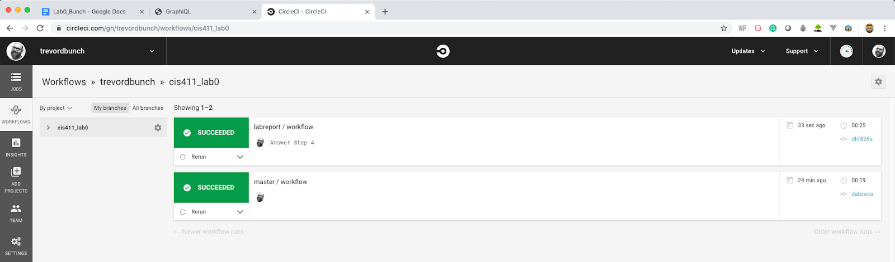

# Lab Report: Continuous Integration
___
**Course:** CIS 411, Spring 2021  
**Instructor(s):** [Trevor Bunch](https://github.com/trevordbunch)  
**Name:** Your Name  
**GitHub Handle:** Your GitHub Handle  
**Repository:** Your Forked Repository  
___

# Step 1: Fork this repository
- The URL of my forked repository: ENTER URL HERE
- The accompanying diagram of what my fork precisely and conceptually represents...

# Step 2: Clone your forked repository from the command line  
- My local file directory is...
- The command to navigate to the directory when I open up the command line is...

# Step 3: Run the application locally
- My GraphQL response from adding myself as an account on the test project
``` json
{
  "data": {
    "mutateAccount": {
      "id": "5c345bb5-0c54-44ae-8e57-f5f00b0eddbb",
      "name": "TREVOR BUNCH",
      "email": "tbunch@messiah.edu"
    }
  }
}
```

# Step 4: Creating a feature branch
- The output of my git commit log
```
Insert the logs here.
```
- The accompanying diagram of what my feature branch precisely and conceptually represents...

# Step 5: Setup a Continuous Integration configuration
- What is the .circleci/config.yml doing?  


- What do the various sections on the config file do?  
   

- When a CI build is successful, what does that philosophically and practically/precisely indicate about the build?  
   

- If you were to take the next step and ready this project for Continuous Delivery, what additional changes might you make in this configuration (conceptual, not code)?  
   

# Step 6: Merging the feature branch
* The output of my git commit log
```
Trevors-MBP:cis411_lab0 trevorbunch$ git log --oneline
dbf826a (HEAD -> labreport, origin/labreport) Answer Step 4
a9c1de6 Complete Step 1, 2 and 3 of LAB_TREVORDBUNCH
1ead543 remove LAB.md
8c38613 Initial commit of labreport with @tangollama
dabceca (upstream/master, origin/master, origin/HEAD, master) Merge pull request #24 from tangollama/circleci
a4096db Create README.md
...
44ce6ae Initial commit
(END)
```

* A screenshot of the _Jobs_ list in CircleCI


# Step 7: Submitting a Pull Request
_Remember to reference at least one other student in the PR content via their GitHub handle._


# Step 8: [EXTRA CREDIT] Augment the core project
PR reference in the report to one of the following:
1. Add one or more unit tests to the core assignment project. 
2. Configure the CircleCI config.yml to automatically build a Docker image of the project.
3. Configure an automatic deployment of the successful CircleCI build to an Amazon EC2 instance.
