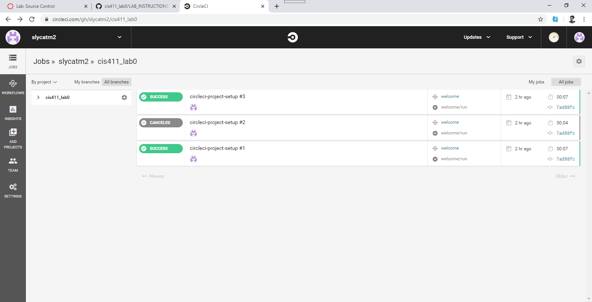

# Lab Report Template for CIS411_Lab0
Course: Messiah College CIS 411, Fall 2018<br/>
Instructors: [Joel Worrall](https://github.com/tangollama) & [Trevor Bunch](https://github.com/trevordbunch)<br/>
Name: YOUR NAME<br/>
GitHub: [YOUR_HANDLE](https://github.com/YOUR_HANDLE)<br/>

# Step 1: Fork this repository
- The URL of my forked repository
- The accompanying diagram of what my fork precisely and conceptually represents

# Step 2: Clone your forked repository from the command line
- My GraphQL response from adding myself as an account on the test project
```
{
  "data": {
    "mutateAccount": {
      "id": "01c23c2b-c145-44ad-bf5f-9d3f535e8a59",
      "name": "Matthew Steven Coates",
      "email": "MC1459@messiah.edu"
    }
  }
}
```

# Step 3: Creating a feature branch
- The output of my git commit log
```
59edb99 (HEAD -> labreport, origin/labreport) This is my first commit
dabceca (origin/master, origin/HEAD, master) Merge pull request #24 from tangollama/circleci
a4096db Create README.md
2f01bf4 Update LAB_INSTRUCTIONS.md
347bd50 Update LAB_INSTRUCTIONS.md
7aaa9f3 Update LAB_INSTRUCTIONS.md
37393ae Bug fixed
1949d2a Update LAB_INSTRUCTIONS.md
d36ad90 Update LAB.md
59ef18a Update LAB_INSTRUCTIONS.md
37be3c8 Update LAB_INSTRUCTIONS.md
97da547 Update LAB.md
0bd6244 (origin/purelab) updated Step 0 title
4562cd8 added npm and node install repreq
255051e adding template
13a09b7 Adding the LAB.md and correcting some instructions.
d2ddea5 Version 0.0.1 of the lab isntructions
ab312fc more progress
62fb0a5 more progress
fe1937b more in the lab instructions
3e807fb first section
9ae6b83 remove LAB.md

```
- The accompanying diagram of what my feature branch precisely and conceptually represents

# Step 4: Setup a Continuous Integration configuration
- What is the .circleci/config.yml doing?
- Trying to configure the version of the of CircleCI pipeline 
-(2.1)
- What do the various sections on the config file do?
-Orbs Declare a dependency on the welcome-orb and Orchestrate -or schedule a set of jobs. Workflows run the welcome/run job -in its own container
- When a CI build is successful, what does that philosophically and practically/precisely indicate about the build?
-That the build passed all of it's yarn tests and lacks bugs
- If you were to take the next step and ready this project for Continuous Delivery, what additional changes might you make in this configuration (conceptual, not code)?
-Run more tests on it to cut down on the need to release -patches to fix bugs

# Step 5: Merging the feature branch
* The output of my git commit log
3b912e5 (HEAD -> master, labreport) Hello World
59edb99 (origin/labreport) This is my first commit
dabceca (origin/master, origin/HEAD) Merge pull request #24 from tangollama/circleci
a4096db Create README.md
2f01bf4 Update LAB_INSTRUCTIONS.md
347bd50 Update LAB_INSTRUCTIONS.md
7aaa9f3 Update LAB_INSTRUCTIONS.md
37393ae Bug fixed
1949d2a Update LAB_INSTRUCTIONS.md
d36ad90 Update LAB.md
59ef18a Update LAB_INSTRUCTIONS.md
37be3c8 Update LAB_INSTRUCTIONS.md
97da547 Update LAB.md
0bd6244 (origin/purelab) updated Step 0 title
4562cd8 added npm and node install repreq
255051e adding template
13a09b7 Adding the LAB.md and correcting some instructions.
d2ddea5 Version 0.0.1 of the lab isntructions
ab312fc more progress
62fb0a5 more progress
fe1937b more in the lab instructions
3e807fb first section

* A screenshot of the _Jobs_ list in CircleCI



# Step 6: Submitting a Pull Request
_Remember to reference at least one other student in the PR content via their GitHub handle._

# Step 7: [EXTRA CREDIT] Augment the core project
PR reference in the report to one of the following:
1. Add one or more unit tests to the core assignment project. 
2. Configure the CircleCI config.yml to automatically build a Docker image of the project.
3. Configure an automatic deployment of the successful CircleCI build to an Amazon EC2 instance.
