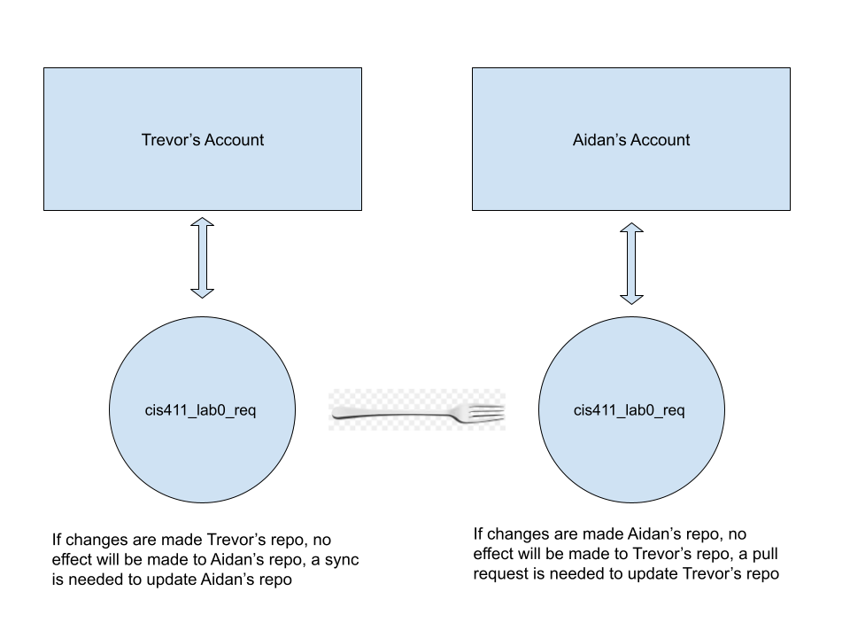
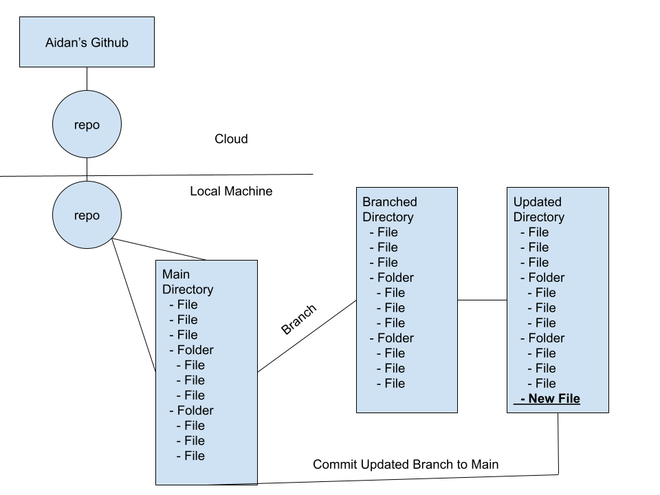
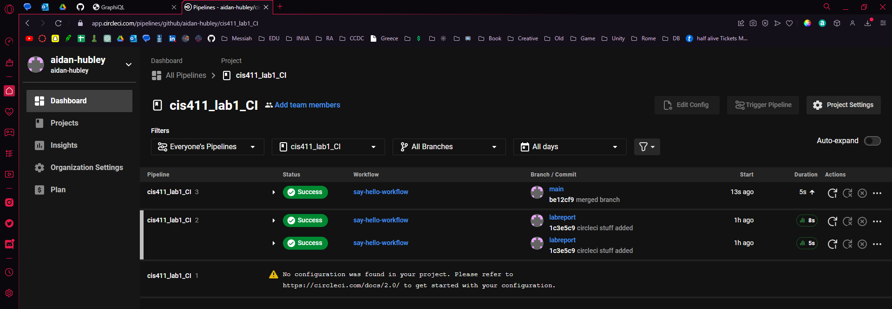

# Lab Report: Continuous Integration
___
**Course:** CIS 411, Spring 2021  
**Instructor(s):** [Trevor Bunch](https://github.com/trevordbunch)  
**Name:** Your Name  
**GitHub Handle:** Your GitHub Handle  
**Repository:** Your Forked Repository  
___

# Step 1: Fork this repository
- The URL of my forked repository: https://github.com/aidan-hubley/cis411_lab1_CI
- The accompanying diagram of what my fork precisely and conceptually represents:


___

# Step 2: Clone your forked repository from the command line  
- My local file directory is C:\Users\aidan\Desktop\CIS411
- The command to navigate to the directory when I open up the command line is:
```
cd ..\..\Users\aidan\Desktop\CIS411\cis411_lab1_CI
```

___

# Step 3: Run the application locally
- My GraphQL response from adding myself as an account on the test project
``` json
{
  "data": {
    "mutateAccount": {
      "id": "e1d0dc08-e73e-406e-a4fa-81670cc96b4c",
      "name": "AIDAN HUBLEY",
      "email": "ah1632@messiah.edu"
    }
  }
}
```

___

# Step 4: Creating a feature branch
- The output of my git commit log
```
c4ea154 (HEAD -> labreport, origin/labreport) This is a commit message, hi @trevorbunch
fa4fc85 (origin/purelab, origin/HEAD, purelab) Update Instructions
f8513e0 Update Node links to Instructions
d4f22eb Update repo branch names
0e3ae4c Reset purelab
050b420 Merge pull request #2 from trevordbunch/main
1fe415c Merge pull request #1 from trevordbunch/labreport
13e571f Update Lab readme, instructions and templates
eafe253 Adjust submitting instructions
47e83cd Add images to LabReport
ec18770 Add Images
dbf826a Answer Step 4
a9c1de6 Complete Step 1, 2 and 3 of LAB_TREVORDBUNCH
1ead543 remove LAB.md
8c38613 Initial commit of labreport with @tangollama
dabceca Merge pull request #24 from tangollama/circleci
a4096db Create README.md
2f01bf4 Update LAB_INSTRUCTIONS.md
347bd50 Update LAB_INSTRUCTIONS.md
7aaa9f3 Update LAB_INSTRUCTIONS.md
37393ae Bug fixed
1949d2a Update LAB_INSTRUCTIONS.md
d36ad90 Update LAB.md
59ef18a Update LAB_INSTRUCTIONS.md
37be3c8 Update LAB_INSTRUCTIONS.md
97da547 Update LAB.md
0bd6244 updated Step 0 title
4562cd8 added npm and node install repreq
255051e adding template
13a09b7 Adding the LAB.md and correcting some instructions.
d2ddea5 Version 0.0.1 of the lab isntructions
ab312fc more progress
62fb0a5 more progress
fe1937b more in the lab instructions
3e807fb first section
9ae6b83 remove LAB.md
e429c1a lab instructions
ce1fcea circleci default config
80bbdbb circleci default config
968099e remove test db
7362cd1 working
44ce6ae Initial commit
```
- The accompanying diagram of what my feature branch precisely and conceptually represents


___

# Step 5: Setup a Continuous Integration configuration
1. What is the .circleci/config.yml doing?
   1. The config.yml file created a job for the circleci server to run.


2. What do the various sections on the config file do?
   1. 'version:' Names the version of CircleCI pipeline process engine.
   2. 'jobs:' Define a job to be invoked later in a workflow.
      3. 'say-hello:' Is the first (and only) job created.
      4. 'docker:' Specifies the execution environment. You can specify an image from Dockerhub or use one of our Convenience Images from CircleCI's Developer Hub
   5. 'steps:' Adds steps to the job.
      6. 'run:' Lists the functions to be run in the job.
         7. 'name:' Names the function.
         8. 'command:' When run, will print text in the output of a job.
   9. 'workflows:' Define a workflow to invoke a job.
      10. 'say-hello-workflow:' A new workflow.
          11. 'jobs:' Lists the jobs to be invoked by the workflow.


3. When a CI build is successful, what does that philosophically and practically/precisely indicate about the build?  
   1. When the CI build successfully completes that practically allow code is executable-able, philosophically this means that you have reached the next step towards reaching your end goal.


4. If you were to take the next step and ready this project for Continuous Delivery, what additional changes might you make in this configuration (conceptual, not code)?
   1. If this project was prepared for Continuous Delivery, I would add a patch notes / version tracker section to document and account for the continuous nature for Continuous Delivery.

___

# Step 6: Merging the feature branch
* The output of my git commit log:
```
d4f011d (HEAD -> main) Merge branch 'labreport'
830a537 (labreport) labreport branch merge
1c3e5c9 (origin/labreport) circleci stuff added
c4ea154 This is a commit message, hi @trevorbunch
fa4fc85 (upstream/purelab, upstream/HEAD, origin/purelab, origin/HEAD, purelab) Update Instructions
f8513e0 Update Node links to Instructions
7490dcb (upstream/main) Add Links to Node in Instructions
ecaaa53 Update branch terminology
d4f22eb Update repo branch names
c552213 Merge pull request #3 from hallienicholas/main
78ede9f Corrected error
0e3ae4c Reset purelab
050b420 Merge pull request #2 from trevordbunch/main
1fe415c Merge pull request #1 from trevordbunch/labreport
13e571f Update Lab readme, instructions and templates
eafe253 Adjust submitting instructions
47e83cd Add images to LabReport
ec18770 Add Images
dbf826a Answer Step 4
a9c1de6 Complete Step 1, 2 and 3 of LAB_TREVORDBUNCH
1ead543 remove LAB.md
8c38613 Initial commit of labreport with @tangollama
dabceca Merge pull request #24 from tangollama/circleci
a4096db Create README.md
2f01bf4 Update LAB_INSTRUCTIONS.md
347bd50 Update LAB_INSTRUCTIONS.md
7aaa9f3 Update LAB_INSTRUCTIONS.md
37393ae Bug fixed
1949d2a Update LAB_INSTRUCTIONS.md
d36ad90 Update LAB.md
59ef18a Update LAB_INSTRUCTIONS.md
37be3c8 Update LAB_INSTRUCTIONS.md
97da547 Update LAB.md
0bd6244 updated Step 0 title
4562cd8 added npm and node install repreq
255051e adding template
13a09b7 Adding the LAB.md and correcting some instructions.
d2ddea5 Version 0.0.1 of the lab isntructions
ab312fc more progress
62fb0a5 more progress
fe1937b more in the lab instructions
3e807fb first section
9ae6b83 remove LAB.md
e429c1a lab instructions
ce1fcea circleci default config
80bbdbb circleci default config
968099e remove test db
7362cd1 working
44ce6ae Initial commit
```

* A screenshot of the _Jobs_ list in CircleCI


___
# Step 7: Submitting a Pull Request
_Remember to reference at least one other student in the PR content via their GitHub handle._


# Step 8: [EXTRA CREDIT] Augment the core project
PR reference in the report to one of the following:

1. Add one or more unit tests to the core assignment project. 

   - With help from ChatGPT and Ray Truex (rt1252) I was able to get run more unit tests.

2. Configure the CircleCI config.yml to automatically build a Docker image of the project.

   

3. Configure an automatic deployment of the successful CircleCI build to an Amazon EC2 instance.
