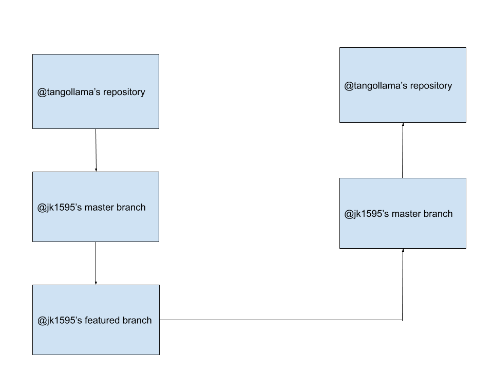
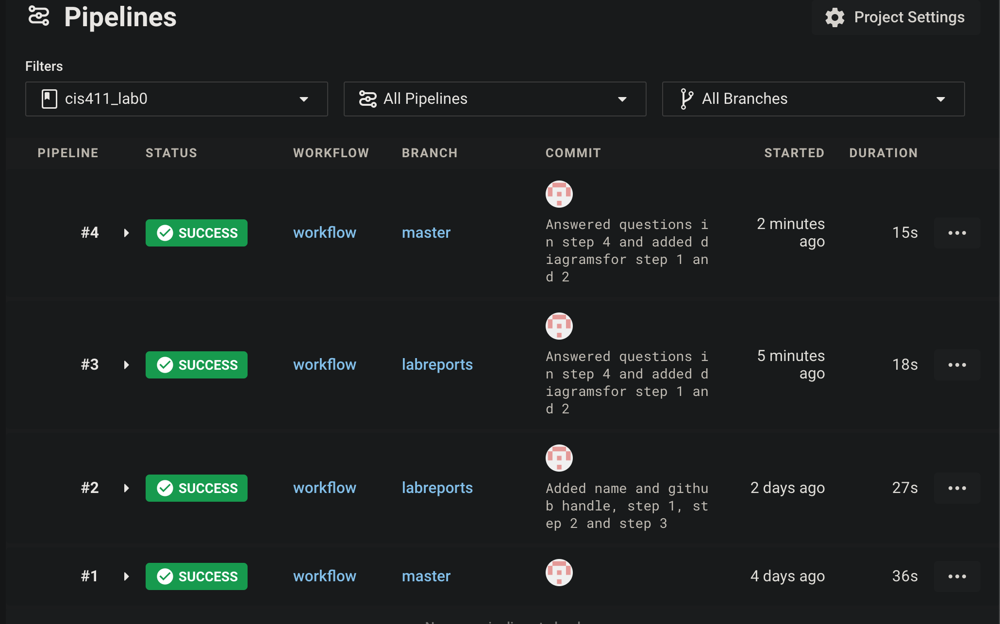

# Lab Report Template for CIS411_Lab0

Course: Messiah College CIS 411, Fall 2018<br/>
Instructors: [Joel Worrall](https://github.com/tangollama) & [Trevor Bunch](https://github.com/trevordbunch)<br/>
Name: Joshua Keong <br/>
GitHub: [Joshua Keong](https://github.com/jk1595)<br/>

# Step 1: Fork this repository

- https://github.com/jk1595/cis411_lab0
- The accompanying diagram of what my fork precisely and conceptually represents
- 

# Step 2: Clone your forked repository from the command line

- My GraphQL response from adding myself as an account on the test project

```
{
  "data": {
    "mutateAccount": {
      "id": "e332f5d5-1678-4e25-9194-cece57a7e3ca",
      "name": "Joshua Keong Wei Xian",
      "email": "jk1595@messiah.edu"
    }
  }
}
```

# Step 3: Creating a feature branch

- The output of my git commit log

```
23e5619 (HEAD -> labreports, origin/labreports) done! @tangollama
dabceca (upstream/master, origin/master, origin/HEAD, master) Merge pull request #24 from tangollama/circleci
a4096db Create README.md
2f01bf4 Update LAB_INSTRUCTIONS.md
347bd50 Update LAB_INSTRUCTIONS.md
a4096db Create README.md
2f01bf4 Update LAB_INSTRUCTIONS.md
347bd50 Update LAB_INSTRUCTIONS.md
347bd50 Update LAB_INSTRUCTIONS.md
347bd50 Update LAB_INSTRUCTIONS.md
23e5619 (HEAD -> labreports, origin/labreports) done! @tangollama
dabceca (upstream/master, origin/master, origin/HEAD, master) Merge pull request
 #24 from tangollama/circleci
a4096db Create README.md
2f01bf4 Update LAB_INSTRUCTIONS.md
347bd50 Update LAB_INSTRUCTIONS.md
2f01bf4 Update LAB_INSTRUCTIONS.md
347bd50 Update LAB_INSTRUCTIONS.md
7aaa9f3 Update LAB_INSTRUCTIONS.md
37393ae Bug fixed
1949d2a Update LAB_INSTRUCTIONS.md
d36ad90 Update LAB.md
59ef18a Update LAB_INSTRUCTIONS.md
37be3c8 Update LAB_INSTRUCTIONS.md
97da547 Update LAB.md
0bd6244 (upstream/purelab, origin/purelab) updated Step 0 title
4562cd8 added npm and node install repreq
255051e adding template
13a09b7 Adding the LAB.md and correcting some instructions.
d2ddea5 Version 0.0.1 of the lab isntructions
ab312fc more progress
62fb0a5 more progress
fe1937b more in the lab instructions
3e807fb first section
9ae6b83 remove LAB.md
e429c1a lab instructions
ce1fcea circleci default config
80bbdbb circleci default config
968099e remove test db
7362cd1 working
44ce6ae Initial commit
```

- The accompanying diagram of what my feature branch precisely and conceptually represents
  

# Step 4: Setup a Continuous Integration configuration

- What is the .circleci/config.yml doing?
  The config.yml file contains instructions and configurations that circleci goes through to make sure the code is able to deploy successfully.

- What do the various sections on the config file do?
  The 'version' section tells which version of the CircleCi platform you are using.
  The 'jobs' section contains arbitrary named children.
  The 'steps' section contains run directives and is being excuted in the sequence it is arranged in.
  The 'name' section contains the name of the commands being run which makes it easier to detect where the error is.
  The 'command' section contains a list of shell commands that shows the work you want done.

- When a CI build is successful, what does that philosophically and practically/precisely indicate about the build?
  It means that circleci has succesfully followed all required instructions and integrations listed in the config file and has been deployed to the server.

- If you were to take the next step and ready this project for Continuous Delivery, what additional changes might you make in this configuration (conceptual, not code)?
  Configuring manual processes such as building, deploying and testing to be automated.
  Ensure that deployable systems can be upgraded or configured without any downtime.

# Step 5: Merging the feature branch

- The output of my git commit log
  d4b08cf (HEAD -> labreports, origin/master, origin/labreports, origin/HEAD, master) Answered questions in step 4 and added diagramsfor step 1 and 2
  e66fff4 Added name and github handle, step 1, step 2 and step 3
  23e5619 done! @tangollama
  dabceca (upstream/master) Merge pull request #24 from tangollama/circleci
  a4096db Create README.md
  2f01bf4 Update LAB_INSTRUCTIONS.md
  347bd50 Update LAB_INSTRUCTIONS.md
  7aaa9f3 Update LAB_INSTRUCTIONS.md
  37393ae Bug fixed
  1949d2a Update LAB_INSTRUCTIONS.md
  d36ad90 Update LAB.md
  59ef18a Update LAB_INSTRUCTIONS.md
  37be3c8 Update LAB_INSTRUCTIONS.md
  97da547 Update LAB.md
  0bd6244 (upstream/purelab, origin/purelab) updated Step 0 title
  4562cd8 added npm and node install repreq
  255051e adding template
  13a09b7 Adding the LAB.md and correcting some instructions.
  d2ddea5 Version 0.0.1 of the lab isntructions
  ab312fc more progress
  62fb0a5 more progress
  fe1937b more in the lab instructions

- A screenshot of the _Jobs_ list in CircleCI
  

# Step 6: Submitting a Pull Request

_Remember to reference at least one other student in the PR content via their GitHub handle._

# Step 7: [EXTRA CREDIT] Augment the core project

PR reference in the report to one of the following:

1. Add one or more unit tests to the core assignment project.
2. Configure the CircleCI config.yml to automatically build a Docker image of the project.
3. Configure an automatic deployment of the successful CircleCI build to an Amazon EC2 instance.
