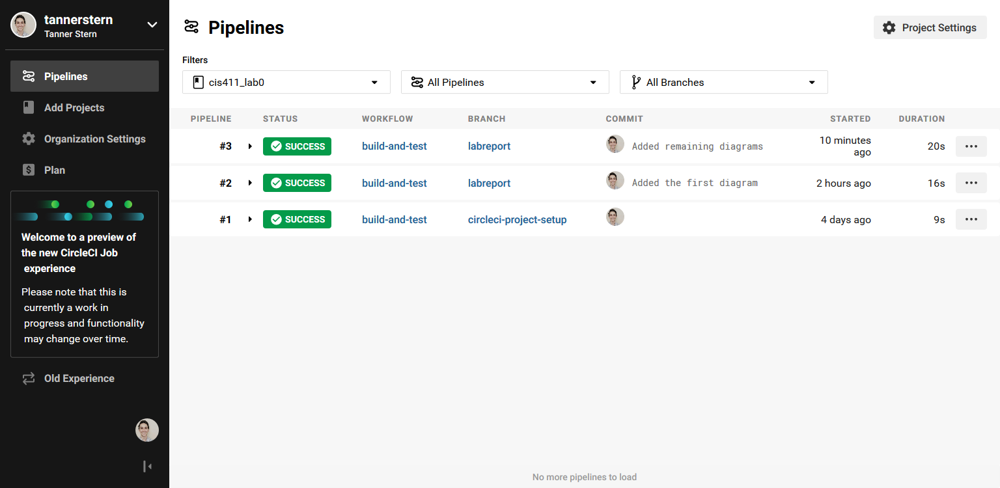

# Lab Report Template for CIS411_Lab0
Course: Messiah College CIS 411, Fall 2018<br/>
Instructors: [Trevor Bunch](https://github.com/trevordbunch) & [Joel Worrall](https://github.com/tangollama)<br/>
Name: Tanner Stern<br/>
GitHub: [tannerstern](https://github.com/tannerstern)<br/>
Following: [tangollama](https://github.com/tangollama)<br/>

# Step 1: Fork this repository
The URL of my forked repository: https://github.com/tannerstern/cis411_lab0

<br/>
The accompanying diagram of what my fork precisely and conceptually represents
- Forking a repository makes a distinct duplicate repository from the original repository
- My repository and another student's repository and distinct
- The two repositories (tangollama's and my own) will not be merged

# Step 2: Clone your forked repository from the command line
My GraphQL response from adding myself as an account on the test project
```
{
  "data": {
    "mutateAccount": {
      "id": "a4038a01-1c88-4f39-96d6-4ea8e5c2b0f4",
      "name": "Tanner Stern",
      "email": "ts1377@messiah.edu"
    }
  }
}
```

# Step 3: Creating a feature branch
The output of my git commit log
```
872f6c1 (HEAD -> labreport, origin/labreport) First update to lab report per @tangollama request
dabceca (origin/master, origin/HEAD, master) Merge pull request #24 from tangollama/circleci
a4096db Create README.md
2f01bf4 Update LAB_INSTRUCTIONS.md
347bd50 Update LAB_INSTRUCTIONS.md
7aaa9f3 Update LAB_INSTRUCTIONS.md
37393ae Bug fixed
1949d2a Update LAB_INSTRUCTIONS.md
d36ad90 Update LAB.md
59ef18a Update LAB_INSTRUCTIONS.md
37be3c8 Update LAB_INSTRUCTIONS.md
97da547 Update LAB.md
0bd6244 (origin/purelab) updated Step 0 title
4562cd8 added npm and node install repreq
255051e adding template
13a09b7 Adding the LAB.md and correcting some instructions.
d2ddea5 Version 0.0.1 of the lab isntructions
ab312fc more progress
62fb0a5 more progress
fe1937b more in the lab instructions
3e807fb first section
9ae6b83 remove LAB.md
e429c1a lab instructions
ce1fcea circleci default config
80bbdbb circleci default config
968099e remove test db
7362cd1 working
44ce6ae Initial commit
```
<br/>
The accompanying diagram of what my feature branch precisely and conceptually represents
- The master branch remains unchanged as I make changes to my own branch
- Any changes I make in my branch will eventually need to be merged into the master

# Step 4: Setup a Continuous Integration configuration
<br/>
- What is the .circleci/config.yml doing?
  - The `.circleci/config.yml` file orchestrates the integration and delivery process. The stanzas contained within the file define how the build and deploy process should unfold. CircleCI looks for the `config.yml` file in the `.circleci` directory at the top of the project branch. Every time code is changed in the remote repository, CircleCI executes the commands within the configuration file to accomplish whatever CI process is needed, be it executing automated tests in a virtual environment or deploying to an Amazon EC2 instance.
- What do the various sections on the config file do?
  - `version` defines what version of CircleCI the file is being used
  - `orbs` are pre-built configurations that can be imported into the configuration
  - `jobs` are the named jobs to be executed by CircleCI to accomplish the CI process
    - Jobs include environments (`executors` or containers) to specify where to run the job
    - `steps` are the actions and commands for CircleCI to execute. They are what CircleCI is "doing."
  - `workflows` define the order in which the jobs should be executed
    - If a job `requires` another job to be completed before it is run, that behavior is specified here
- When a CI build is successful, what does that philosophically and practically/precisely indicate about the build?
  - A successful CI build means that the code or changes that have been committed to the repository have been successfully integrated. Philosophically, this means that changes to the code did not "formally" break anything and have integrated with existing code. Practically, all tests that were run against the updated codebase were successful, and the build did not experience any errors. This does not mean that code is entirely free of errors or works exactly as intended. Rather, per the tests and build instructions, everything worked correctly.
- If you were to take the next step and ready this project for Continuous Delivery, what additional changes might you make in this configuration (conceptual, not code)?
  - After testing and integration, the build should be approved. A means to halt the operation until test results have been approved would be useful, or at least a notification that informs the project manager that CI was successful.
  - The `config.yml` file would need to have a way to deploy the project when it is run. The CircleCI website mentions deploying to several different environments, including AWS CodeDeploy, Microsoft Azure, and Heroku. All of these environments (like the virtual enironments for testing) would require stanzas to establish the connection.

# Step 5: Merging the feature branch
The output of my git commit log
```
28e8980 (HEAD -> master, origin/labreport, labreport) Added remaining diagrams
e4e11cd Added the first diagram
872f6c1 First update to lab report per @tangollama request
dabceca (origin/master, origin/HEAD) Merge pull request #24 from tangollama/circleci
a4096db Create README.md
2f01bf4 Update LAB_INSTRUCTIONS.md
347bd50 Update LAB_INSTRUCTIONS.md
7aaa9f3 Update LAB_INSTRUCTIONS.md
37393ae Bug fixed
1949d2a Update LAB_INSTRUCTIONS.md
d36ad90 Update LAB.md
59ef18a Update LAB_INSTRUCTIONS.md
37be3c8 Update LAB_INSTRUCTIONS.md
97da547 Update LAB.md
0bd6244 (origin/purelab) updated Step 0 title
4562cd8 added npm and node install repreq
255051e adding template
13a09b7 Adding the LAB.md and correcting some instructions.
d2ddea5 Version 0.0.1 of the lab isntructions
ab312fc more progress
62fb0a5 more progress
fe1937b more in the lab instructions

```
<br/>
A screenshot of the _Jobs_ list in CircleCI

# Step 6: Submitting a Pull Request
_Remember to reference at least one other student in the PR content via their GitHub handle._

# Step 7: [EXTRA CREDIT] Augment the core project
PR reference in the report to one of the following:
1. Add one or more unit tests to the core assignment project. 
2. Configure the CircleCI config.yml to automatically build a Docker image of the project.
3. Configure an automatic deployment of the successful CircleCI build to an Amazon EC2 instance.
