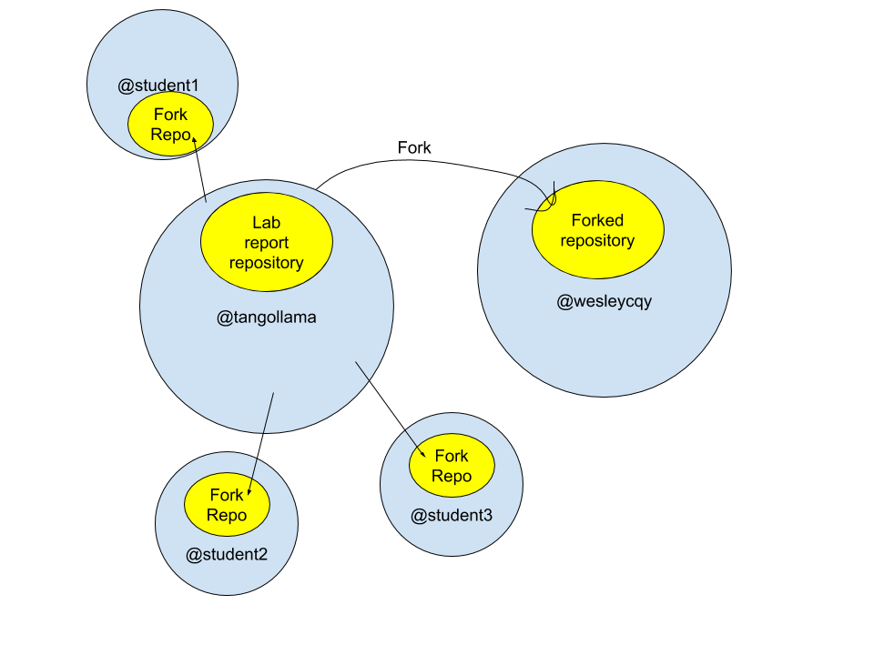
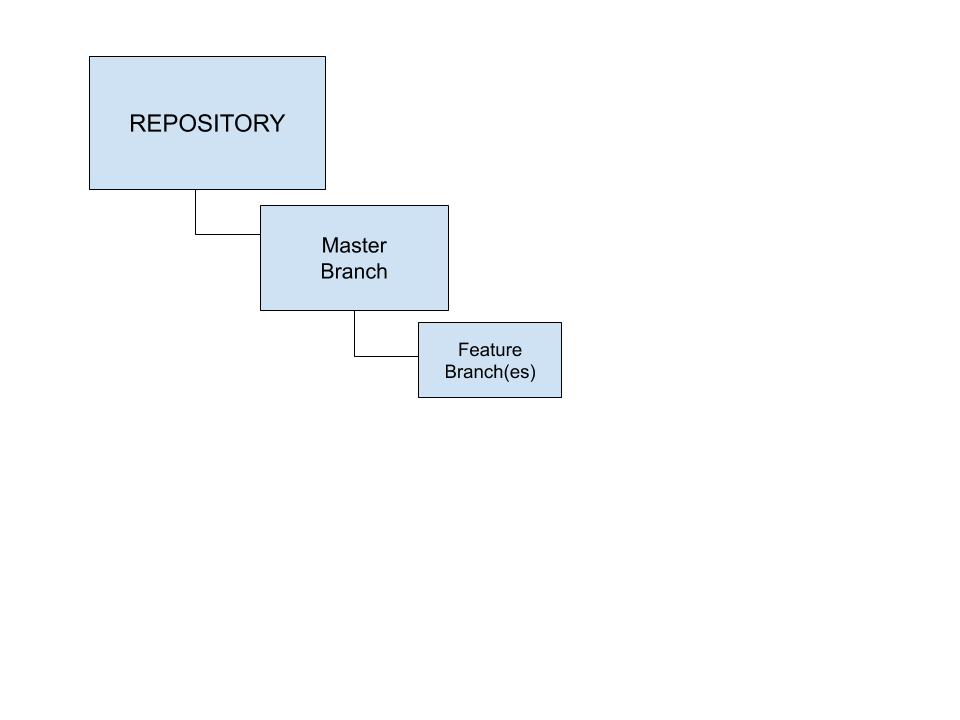
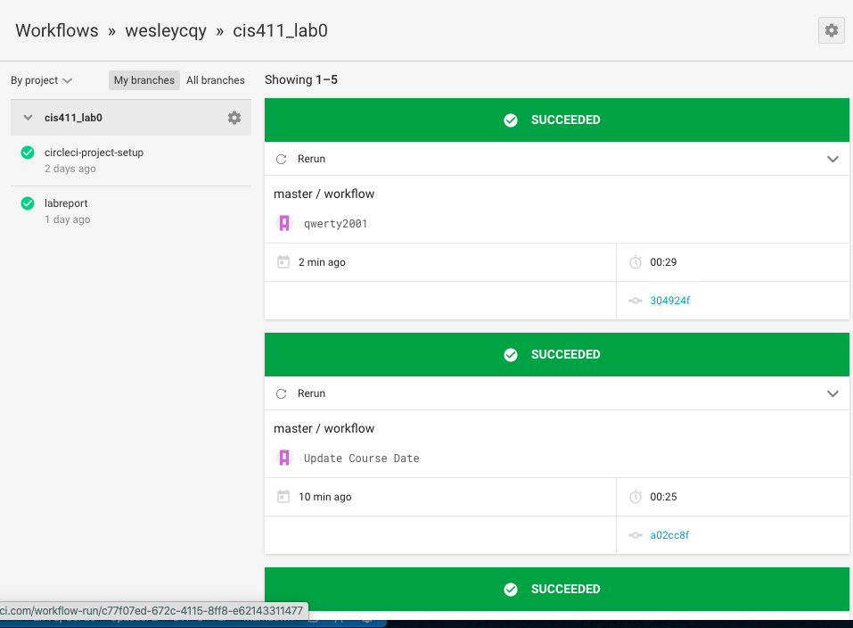

# Lab Report Template for CIS411_Lab0
Course: Messiah College CIS 411, Spring 2020<br/>
Instructors: [Joel Worrall](https://github.com/tangollama) & [Trevor Bunch](https://github.com/trevordbunch)<br/>
Name: Wesley Chong<br/>
GitHub: [Wesley Chong](https://github.com/wesleycqy)<br/>

# Step 1: Fork this repository
- https://github.com/wesleycqy/cis411_lab0.git
- 
- When I forked @tangollama's repository, I essentially "copied" his entire code onto my machine to use. From there, I am free to edit and use it. This is different compared to a source control branch. That is where a code simply branches out rather than copying all of the code down. This may be done to merge add new features among other things and eventually merge back into the original codebase whereelse forking does not. 


# Step 2: Clone your forked repository from the command line
- My GraphQL response from adding myself as an account on the test project
```
{
  "data": {
    "mutateAccount": {
      "id": "02b9d2e7-f52d-41cd-a55e-df98a4438cb2",
      "name": "Wesley Chong",
      "email": "wesleychong7@gmail.com"
    }
  }
}
```

# Step 3: Creating a feature branch
- The output of my git commit log
```
fdf76b3 (HEAD -> labreport, origin/labreport) abcdefg @tangollama
dabceca (origin/master, origin/HEAD, master) Merge pull request #24 from tangollama/circleci
a4096db Create README.md
2f01bf4 Update LAB_INSTRUCTIONS.md
347bd50 Update LAB_INSTRUCTIONS.md
7aaa9f3 Update LAB_INSTRUCTIONS.md
37393ae Bug fixed
1949d2a Update LAB_INSTRUCTIONS.md
d36ad90 Update LAB.md
59ef18a Update LAB_INSTRUCTIONS.md
37be3c8 Update LAB_INSTRUCTIONS.md
97da547 Update LAB.md
0bd6244 (origin/purelab) updated Step 0 title
4562cd8 added npm and node install repreq
255051e adding template
13a09b7 Adding the LAB.md and correcting some instructions.
d2ddea5 Version 0.0.1 of the lab isntructions
ab312fc more progress
62fb0a5 more progress
fe1937b more in the lab instructions
3e807fb first section
9ae6b83 remove LAB.md
e429c1a lab instructions
ce1fcea circleci default config
80bbdbb circleci default config
968099e remove test db
7362cd1 working
44ce6ae Initial commit
```
- 

# Step 4: Setup a Continuous Integration configuration
- Circle.ci allows a developer to edit the code of a program or new feature while the original program still runs appropriately. 
- They allow me to copy a file onto my own site/device and make changes to it without changing the original file. It then makes sure that my edited code is compatible with the original one. 
- It indicates that when I want to push my code up into the original repository, it should work as Circle Ci has already checked it out for me.
- I would make sure the code is always ready to be deployed. Never halfway done to prevent it accidentally deployed and causing issues. 

# Step 5: Merging the feature branch
* 304924f (HEAD -> master, origin/master, origin/HEAD) qwerty2001
a02cc8f Update Course Date
b7d423a Commit 4 Wesley C
b8c210d Commit 3 Wesley Chong
ff1a0e6 commit 3(??) idk man
5e603b4 (origin/labreport, labreport) HI this is commit 2yoyoyo
fdf76b3 abcdefg @tangollama
dabceca Merge pull request #24 from tangollama/circleci
a4096db Create README.md
2f01bf4 Update LAB_INSTRUCTIONS.md
347bd50 Update LAB_INSTRUCTIONS.md
7aaa9f3 Update LAB_INSTRUCTIONS.md
37393ae Bug fixed
1949d2a Update LAB_INSTRUCTIONS.md
d36ad90 Update LAB.md
59ef18a Update LAB_INSTRUCTIONS.md
37be3c8 Update LAB_INSTRUCTIONS.md
97da547 Update LAB.md
0bd6244 (origin/purelab) updated Step 0 title
4562cd8 added npm and node install repreq
255051e adding template
13a09b7 Adding the LAB.md and correcting some instructions.
d2ddea5 Version 0.0.1 of the lab isntructions
ab312fc more progress
62fb0a5 more progress
fe1937b more in the lab instructions
3e807fb first section
9ae6b83 remove LAB.md
e429c1a lab instructions
ce1fcea circleci default config
80bbdbb circleci default config
968099e remove test db
7362cd1 working
44ce6ae Initial commit
* 

# Step 6: Submitting a Pull Request
_Remember to reference at least one other student in the PR content via their GitHub handle._

# Step 7: [EXTRA CREDIT] Augment the core project
PR reference in the report to one of the following:
1. Add one or more unit tests to the core assignment project. 
2. Configure the CircleCI config.yml to automatically build a Docker image of the project.
3. Configure an automatic deployment of the successful CircleCI build to an Amazon EC2 instance.
