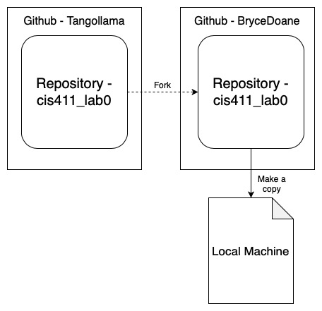
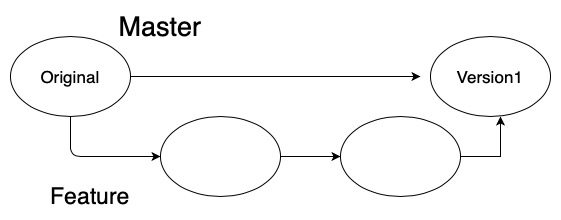
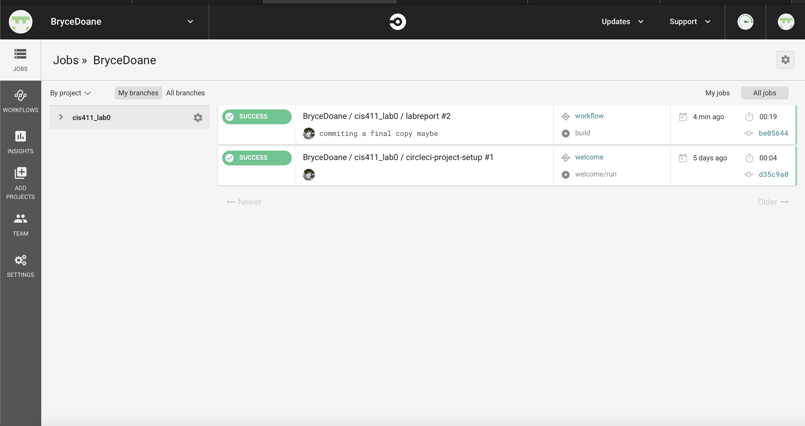

# Lab Report Template for CIS411_Lab0
Course: Messiah College CIS 411, Fall 2018<br/>
Instructors: [Joel Worrall](https://github.com/tangollama) & [Trevor Bunch](https://github.com/trevordbunch)<br/>
Name: Bryce Doane<br/>
GitHub: [BryceDoane](https://github.com/BryceDoane)<br>
Starred Github: [tangollama](https://github.com/tangollama)<br/>

# Step 1: Fork this repository
- https://github.com/BryceDoane/cis411_lab0
- The accompanying diagram of what my fork precisely and conceptually represents



# Step 2: Clone your forked repository from the command line
- My GraphQL response from adding myself as an account on the test project
```
{
  "data": {
    "mutateAccount": {
      "id": "8eff17bc-f9d6-4620-90aa-af4699882695",
      "name": "Bryce Doane",
      "email": "bd1275@messiah.edu"
    }
  }
}
```

# Step 3: Creating a feature branch
- The output of my git commit log
```
08eef0d (HEAD -> labreport, origin/labreport) your commit and reference @tangollama in the message
dabceca (origin/master, origin/HEAD, master) Merge pull request #24 from tangollama/circleci
a4096db Create README.md
2f01bf4 Update LAB_INSTRUCTIONS.md
347bd50 Update LAB_INSTRUCTIONS.md
7aaa9f3 Update LAB_INSTRUCTIONS.md
37393ae Bug fixed
1949d2a Update LAB_INSTRUCTIONS.md
d36ad90 Update LAB.md
59ef18a Update LAB_INSTRUCTIONS.md
37be3c8 Update LAB_INSTRUCTIONS.md
97da547 Update LAB.md
0bd6244 (origin/purelab) updated Step 0 title
4562cd8 added npm and node install repreq
255051e adding template
13a09b7 Adding the LAB.md and correcting some instructions.
d2ddea5 Version 0.0.1 of the lab isntructions
ab312fc more progress
62fb0a5 more progress
fe1937b more in the lab instructions
3e807fb first section

```
- The accompanying diagram of what my feature branch precisely and conceptually represents



# Step 4: Setup a Continuous Integration configuration
- What is the .circleci/config.yml doing?
  <br> <b>The config.yml file essentially declares the conditions that the code will be executed in.  It can include things such as name, version and other metadata while also define conditions such as packages and containers to run the code in.</b>
- What do the various sections on the config file do?
<br> <b>The first section declares which version the code corresponds to.  In this example it is 2.1.  The next section defines the orb (a shareable configuration element) which in this case declares a dependency on the welcome-orb.  Finally, the workflow section defines jobs and their run order. This section declares the workflow name as "welcome" and runs it in its own container.</b>
- When a CI build is successful, what does that philosophically and practically/precisely indicate about the build?
<br> <b> A successful CI build indicates that the build is ready for deployment. </b>
- If you were to take the next step and ready this project for Continuous Delivery, what additional changes might you make in this configuration (conceptual, not code)?
<br> <b> An additional change I would make would be to add more description and metadata in the config file so it is easy to see what the code is supposed to be doing and also set the schedule to only run parts of the code that were changed rather than the whole code piece every time for every delivery. </b>

# Step 5: Merging the feature branch
* The output of my git commit log

```
Bryces-MacBook-Pro:cis411_lab0 brycedoane$ git log --oneline
be05644 (HEAD -> master, origin/labreport, labreport) commiting a final copy maybe
08eef0d your commit and reference @tangollama in the message
dabceca (origin/master, origin/HEAD) Merge pull request #24 from tangollama/circleci
a4096db Create README.md
2f01bf4 Update LAB_INSTRUCTIONS.md
347bd50 Update LAB_INSTRUCTIONS.md
7aaa9f3 Update LAB_INSTRUCTIONS.md
37393ae Bug fixed
1949d2a Update LAB_INSTRUCTIONS.md
d36ad90 Update LAB.md
59ef18a Update LAB_INSTRUCTIONS.md
37be3c8 Update LAB_INSTRUCTIONS.md
97da547 Update LAB.md
0bd6244 (origin/purelab) updated Step 0 title
4562cd8 added npm and node install repreq
255051e adding template
13a09b7 Adding the LAB.md and correcting some instructions.
d2ddea5 Version 0.0.1 of the lab isntructions
ab312fc more progress
62fb0a5 more progress
fe1937b more in the lab instructions
3e807fb first section
9ae6b83 remove LAB.md
e429c1a lab instructions
ce1fcea circleci default config
80bbdbb circleci default config
968099e remove test db
7362cd1 working
44ce6ae Initial commit
```
* A screenshot of the _Jobs_ list in CircleCI


# Step 6: Submitting a Pull Request
_Remember to reference at least one other student in the PR content via their GitHub handle._

# Step 7: [EXTRA CREDIT] Augment the core project
PR reference in the report to one of the following:
1. Add one or more unit tests to the core assignment project. 
2. Configure the CircleCI config.yml to automatically build a Docker image of the project.
3. Configure an automatic deployment of the successful CircleCI build to an Amazon EC2 instance.
